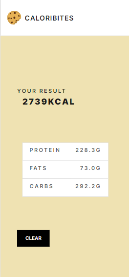

# Caloribites 🍪

This react app is a daily calories intake calculator for athletes\
[Live Preview](https://optimistic-ramanujan-ced7b3.netlify.app/)

## new features in v3
* Completely new design 
* Mobile optimized layout
* Custom components redesigned
* Components animation
* Screen transition animation
* Screen loading 
* Youtube video suggestions
* Landing page

You can check the adobe xd design file in the "stock" folder

## to run locally

fork the project then:

### `npm install`
### `npm start`

## screenshots

